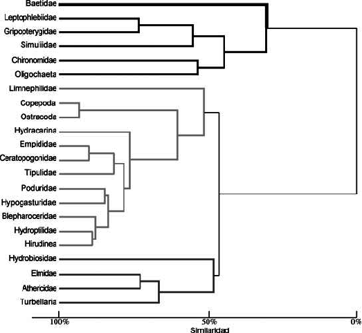
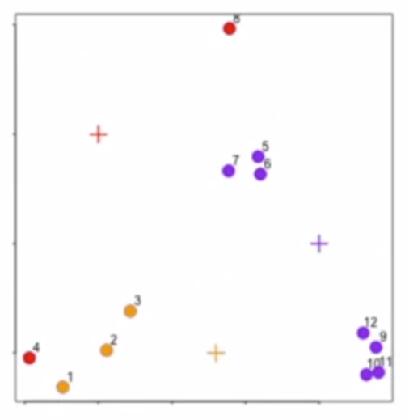
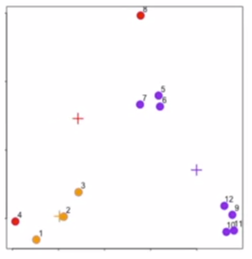
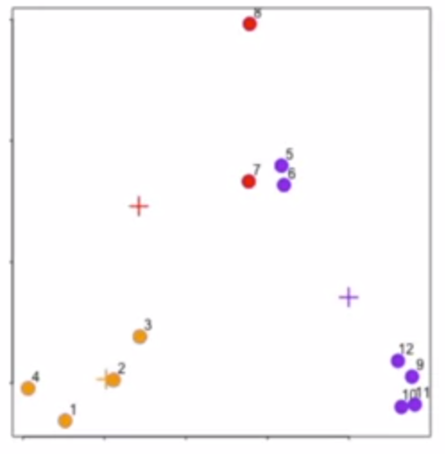
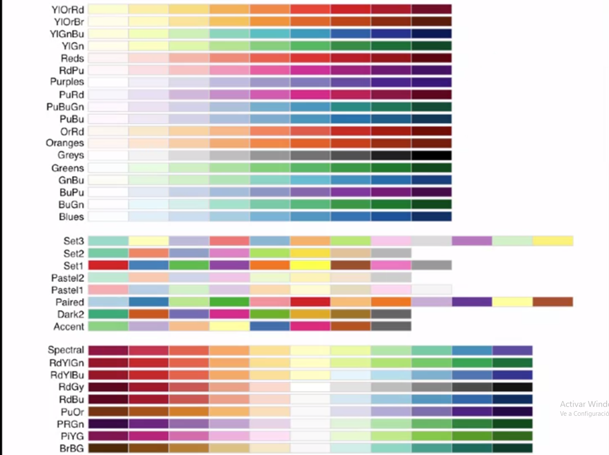

#Hierarchical Clustering (part 1)

Para realizar metodos de clusters es importante preguntarse lo siguiente:

* Como definimos "cercania"
* Como agrupamos cosas
* Como vizualizamos los grupos
* Como interpretamos estos grupos

Es una tecnica de crear grupos por jerarquizacion, con un approach de aglomeracion, se comienza con un dato y se van agregando al cluster.
El metodo de clusters requiere dos cosas importantes:

* La metrica de la distancia
* Una vez que encuentro dos puntos como los uno

El metodo de Hierarcal clustering produce una especie de arbol llamada "dendrogram"".



El punto importante de la distancia tiene 3 posibles interpretaciones:

* Continua: Distancia Euclidiana (linea recta)
* Continua: Correlacion similar
* Binaria: Distancia de manhattan (Por los catetos)

Hay que elegir una metrica que tenga sentido en cada uno de los problemas.


#Hierarchical Clustering (part 2)

```{r Hierarchical Clustering (part 2)}
set.seed(1234)
par(mar = c(0,0,0,0))
x <- rnorm(12, mean = rep(1:3, each = 4), sd = 0.2)
y <- rnorm(12, mean = rep(c(1,2,1), each = 4), sd = 0.2)
plot(x, y, col = "blue", pch = 19, cex = 2)
text(x + 0.05, y + 0.05, labels = as.character(1:12)) #Creamos 8 puntos donde se pueden ver 3 clusters facilmente
data <- data.frame(x = x, y = y)
distxy <- dist(data) #Sin ningun parametro calcula la distancia euclidiana
hClustering <- hclust(distxy)
plot(hClustering) #El ploteo no me entrega la cantidad de clusters, uno debe cortar en el lugar que le parezca apropiado para elegir la cantidad (2.0 = 2 clusters, 1.0 = 3 clusters)
```

#Hierarchical Clustering (part 3)

```{r Hierarchical Clustering (part 3)}
myplclust <- function( hclust, lab=hclust$labels, lab.col=rep(1,length(hclust$labels)), hang=0.1,...){
 ## modifiction of plclust for plotting hclust objects *in colour*!
 ## Copyright Eva KF Chan 2009
 ## Arguments:
 ##    hclust:    hclust object
 ##    lab:        a character vector of labels of the leaves of the tree
 ##    lab.col:    colour for the labels; NA=default device foreground colour
 ##    hang:     as in hclust & plclust
 ## Side effect:
 ##    A display of hierarchical cluster with coloured leaf labels.
 y <- rep(hclust$height,2)
 x <- as.numeric(hclust$merge)
 y <- y[which(x<0)]
 x <- x[which(x<0)]
 x <- abs(x)
 y <- y[order(x)]
 x <- x[order(x)]
 plot( hclust, labels=FALSE, hang=hang, ... )
 text( x=x, y=y[hclust$order]-(max(hclust$height)*hang), labels=lab[hclust$order], col=lab.col[hclust$order], srt=90, adj=c(1,0.5), xpd=NA, ... )}
myplclust(hClustering, lab = rep(1:3, each = 4), lab.col = rep (1:3, each = 4)) #Me entrega los clusters por grupo y color
```

Una de las formas de unir dos puntos en uno solo es tomando el promedio de sus distancias como el nuevo punto del cluster, o se puede tomar la distancia de los puntos mas lejanos de cada cluster. Cada una de las dos metricas dan resultados distintos y dependen del tipo de problema.

```{r Hierarchical Clustering (part 3.1) }
set.seed(153)
dataMatrix <- as.matrix(data)[sample(1:12),]
heatmap(dataMatrix)
```

# K-Means Clustering (part 1)

Para realizar k-means cluster se deben decidir los siguientes conceptos:

* Cuantos clusters quiero
* Encontrar el centroide de cada cluster
* Asignar los puntos a cada centroide
* Recalcular los centroides

El algoritmo de k-means entrega donde estan los centroides de los clusters y a que cluster pertenece cada punto

```{r K-Means Clustering (part 1)}
set.seed(1241212)
par(mar = c(0,0,0,0))
x <- rnorm(12, mean = rep(1:3, each = 4), sd = 0.2)
y <- rnorm(12, mean = rep(c(1,2,1), each = 4), sd = 0.2)
plot(x, y, col = "blue", pch = 19, cex = 2)
text(x + 0.05, y + 0.05, labels = as.character(1:12))
```







#K-Means Clustering (part 2)

```{r K-Means Clustering (part 2)}
set.seed(3)
x <- rnorm(12, mean = rep(1:3, each = 4), sd = 0.2)
y <- rnorm(12, mean = rep(c(1,2,1), each = 4), sd = 0.2)
dataFrame <- data.frame(x,y)
kmeansObj <- kmeans(dataFrame, centers = 3) #Centers indica la cantidad de centroides
names(kmeansObj)
kmeansObj$cluster #Nos indica en que cluster esta cada uno de los puntos
par(mar = rep(0.2,4))
plot(x,y,col = kmeansObj$cluster, pch = 19, cex = 2) ; points(kmeansObj$centers, col = 1:3, pch = 3, cex = 3, lwd = 3)  #Ploteo los puntos y agrego sus centroides

dataMatrix <- as.matrix(dataFrame)[sample(1:12), ]
kmeansObj2 <- kmeans(dataMatrix, centers = 3)
par(mfrow = c(1,2), mar = c(2,3,0.1,0.1))
image(t(dataMatrix)[, nrow(dataMatrix):1], yaxt = "n")
image(t(dataMatrix)[, order(kmeansObj2$cluster)], yaxt = "n") #Mapa de calor
```

#Dimension Reduction (part 1)

```{r Dimension Reduction (part 1)}
set.seed(12345)
par(mar = rep(0.2,4))
dataMatrix <- matrix(rnorm(400), nrow = 40)
image(1:10,1:40,t(dataMatrix)[, nrow(dataMatrix):1])
heatmap(dataMatrix) #Mapa de calor
set.seed(54754)
for (i in 1:40){
        #flip a coin
        coinFlip <- rbinom(1, size =1, prob = 0.5)
        # if coin is heads add a common pattern to that row
        if (coinFlip){
                dataMatrix[i, ] <- dataMatrix[i, ] + rep(c(0,3), each = 5)
        }
} #Creo un àtron para entender mejor el mapa de calor
image(1:10,1:40,t(dataMatrix)[, nrow(dataMatrix):1])
heatmap(dataMatrix)

hh <- hclust(dist(dataMatrix))
dataMatrixOrdered <- dataMatrix[hh$order, ]
par(mfrow = c(1,3))
image(t(dataMatrixOrdered)[, nrow(dataMatrixOrdered):1])
plot(rowMeans(dataMatrixOrdered), 40:1, xlab = "Row mean", ylab = "Row", pch = 19)
plot(colMeans(dataMatrixOrdered), xlab = "Columns", ylab = "Column Mean", pch = 19) #Mapa de calor y como interpretar este

```

Para problemas con muchas variables que probablemente esten correlacionadas es importante intentar realizar estos dos pasos:

* Encontrar un nuevo set de variables que no este correlacionadas y que expliquen bien los datos
* Ponerlas todas en una matrix de menor rango

Para realizar lo anterior existen dos tecnicas:

* SVD (Singular Value Decomposition):

        + Crea 3 matrices de la forma UDV^T^, donde U es es una matriz ortogonal (Matriz izquierda singular), V matriz ortogonal (Matrisz derecha singular) y D es la matriz de valores singulares (*Una matriz ortogonal es la que su matriz traspuesta es igual a la original)
        + PCA (Principal Component Analisis): Esta tecnica dice que si a cada columna le resto el promedio de esta y la divido por su desviacion estandar puedo encontrar la matrix V^T^

#Dimension Reduction (part 2)

```{r Dimension Reduction (part 2)}
svd1 <- svd(scale(dataMatrixOrdered)) #Singular value decomposition
par(mfrow = c(1,3))
image(t(dataMatrixOrdered)[, nrow(dataMatrixOrdered):1])
plot(svd1$u[, 1], 40:1, xlab = "Row", ylab = "First left singular vector", pch = 19) #La mtriz U 
plot(svd1$v[, 1], xlab = "Column", ylab = "First right singular vector", pch = 19) #La mtriz V

par(mfrow = c(1,2)) #Variance explain
plot(svd1$d, xlab = "Columns", ylab = "Singular Value", pch = 19) #Matriz D
plot(svd1$d^2/sum(svd1$d^2), xlab = "Column", ylab = "Prop. of variance explained", pch = 19)# La proporcion de como explica la variacion de la data

svd1 <- svd(scale(dataMatrixOrdered))
pca1 <- prcomp(dataMatrixOrdered, scale = TRUE)
plot(pca1$rotation[, 1], svd1$v[, 1], pch = 19, xlab = "Principal Component 1", ylab = "Right Singular Vector 1")# Se plotea el primer vector de la matriz v de la svd, y el primer vector del pca y se nota que son exactamente iguales como se habia propuesto
abline(c(0,1))

constantMatrix <- dataMatrixOrdered*0 #Variance explained
for(i in 1:dim(dataMatrixOrdered)[1]){constantMatrix[i,] <- rep(c(0,1), each = 5)}
svd1 <- svd(constantMatrix)
par(mfrow = c(1,3))
image(t(constantMatrix)[, nrow(constantMatrix):1])
plot(svd1$d, xlab = "Cloumn", ylab ="Singular Value", pch = 19)
plot(svd1$d^2/sum(svd1$d^2), xlab = "Column", ylab = "Prop. of variance explained", pch = 19)#Esto explica que si estas en las primeras 5 columnas tienes un valor 0 y si estas en las siguientes 5 tienes un valor de 5. Estoy nos ayuda a entender realciones o que algunas columnas o filas no aportan mucho a los datos
```

```{r Dimension Reduction (part 2.1)}
set.seed((31252352))
for(i in 1:40){
        coinFlip1 <- rbinom(1, size = 1, prob = 0.5)
        coinFlip2 <- rbinom(1, size = 1 , prob = 0.5)
        if(coinFlip1){
                dataMatrix[i, ] <- dataMatrix[i, ] + rep(c(0,5), each = 5)
        }
        if(coinFlip2){
                dataMatrix[i, ] <- dataMatrix[i, ] + rep(c(0,5), 5)
        }
}
hh <- hclust(dist(dataMatrix))
dataMatrixOrdered <- dataMatrix[hh$order, ]
svd2 <- svd(scale(dataMatrixOrdered))
par(mfrow = c(1,3))
image(t(dataMatrixOrdered)[, nrow(dataMatrixOrdered):1])
plot(rep(c(0,1), each = 5), pch = 19, xlab = "Column", ylab = "Pattern 1")
plot(rep(c(0,1), 5), pch = 19, xlab = "Column", ylab = "Pattern 2")

svd2 <- svd(scale(dataMatrixOrdered))
par(mfrow = c(1,3))
image(t(dataMatrixOrdered)[, nrow(dataMatrixOrdered):1])
plot(svd2$v[, 1], xlab = "Column", ylab = "First right singular vector", pch = 19) #La mtriz V 
plot(svd2$v[, 2], xlab = "Column", ylab = "Second left singular vector", pch = 19) #La mtriz U

svd1 <-svd(scale(dataMatrixOrdered))
par(mfrow = c(1,2))
plot(svd1$d, xlab = "Column", ylab = "Singular value", pch = 19)
plot(svd1$d^2/sum(svd1$d^2), xlab = "Column", ylab = "Prop. of variance explained", pch = 19) #La primera columna explica mas del 50% de la variacion total de la data
```

#Dimension Reduction (part 3)

```{r Dimension Reduction (part 3)}
dataMatrix2 <- dataMatrixOrdered
dataMatrix2[sample(1:100, size = 40, replace = FALSE)] <- NA
#svd1 <- svd(scale(dataMatrix2)) #No funciona cuando existen NAs
library(impute)
dataMatrix2 <- dataMatrixOrdered
dataMatrix2[sample(1:100, size = 40, replace = FALSE)] <- NA
dataMatrix2 <- impute.knn(dataMatrix2)$data #toma los k valores mas cercanos a el (fila) y convierte el NA en la media de esos K valores
svd1 <- svd(scale(dataMatrixOrdered)) ; svd2 <- svd(scale(dataMatrix2))
par(mfrow = c(1,2)); plot(svd1$v[,1],pch = 19); plot(svd2$v[,1], pch = 19) #Son parecidos pero casi iguales
```

#Ejemplo de cara y como reducir dimensiones Semana 3 lesson 2 ultimo video

#Working with Color in R Plots (part 2)

El paquete "grDevices" tiene dos funciones principales:

* colorRamp: Toma una paleta de colores y returna una funcion que contiene numeros entre 1 y 0
* colorRampPalette: Esta entrega un entero a traves de un vector de colores (se parece a heat o topo color)

Estas dos funciones te permiten interpolar entre colores, la funcion colors() me permite ver todos los colores disponibles

```{r Working with Color in R Plots (part 2)}
library(grDevices)
pal <- colorRamp(c("red","blue")) #Devuelve un vector de largo 3 (Rojo, verde, azul)
pal(0)# (rojo 255 y el resto 0)
pal(1)# azul 255 0 el resto
pal(0.5)#(127,5 de rojo y 127,5 de azul)
pal(seq(0,1,len=10))#Me entrega una secuencia de colores entre rojo y azul
pal <- colorRampPalette(c("red", "yellow")) #Ramp
pal(2)#Me entrega dos colores interpolando los dados (En este caso me entrega los originales
pal(10)#Me entrega un vector de caracteres en hexadecimal(Los primeros dos numero son rojo, los siguientes verdes y los siguientes azules). La F representa el maximo numero en hexadecimal.
```

#Working with Color in R Plots (part 3)

Otra opcion es RColorBrewer, que fue creado para hacer mapploting. Existen 3 tipos de paletas:

* Secuenciales: para datos que estan de menor a mayor
* Divergentes: La desviacion de la media por ejemplo
* Cualitativo: Representar data que no este ordenado, factores, variables categoricas

Estas paletas se pueden pasar a las funciones colorRamp y colorRampPalette para usarlas



```{r Working with Color in R Plots (part 3)}
library(RColorBrewer)
cols <- brewer.pal(3, "BuGn") #Entrega una paleta de colores
cols
pal <- colorRampPalette(cols)
image(volcano, col = pal(20))

x <- rnorm(10000)
y <- rnorm(10000)
smoothScatter(x, y) #Esta funcion permite plotear muchos puntos cuando no te interesan los puntos en si, si no que donde estan agrupados
```

#Working with Color in R Plots (part 4)

Funcion rgb, permite producir cualquier color a partir de rojo, verde y azul. Tambien permite la transparencia de colores con alpha. Colorspace tambien permite jugar con los colores.

```{r Working with Color in R Plots (part 4)}

plot(x,y, pch = 19)
plot(x,y,col = rgb(0,0,0,0.2))  #Le entrego la transparencia a los numeros (Rojo,Verde,Azul,Alpha)
```